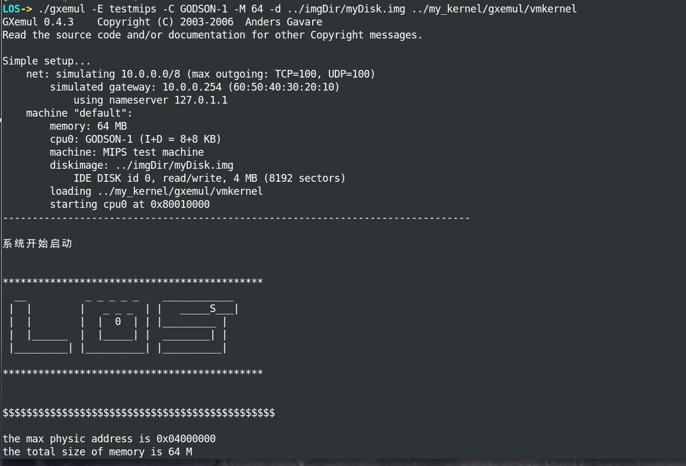
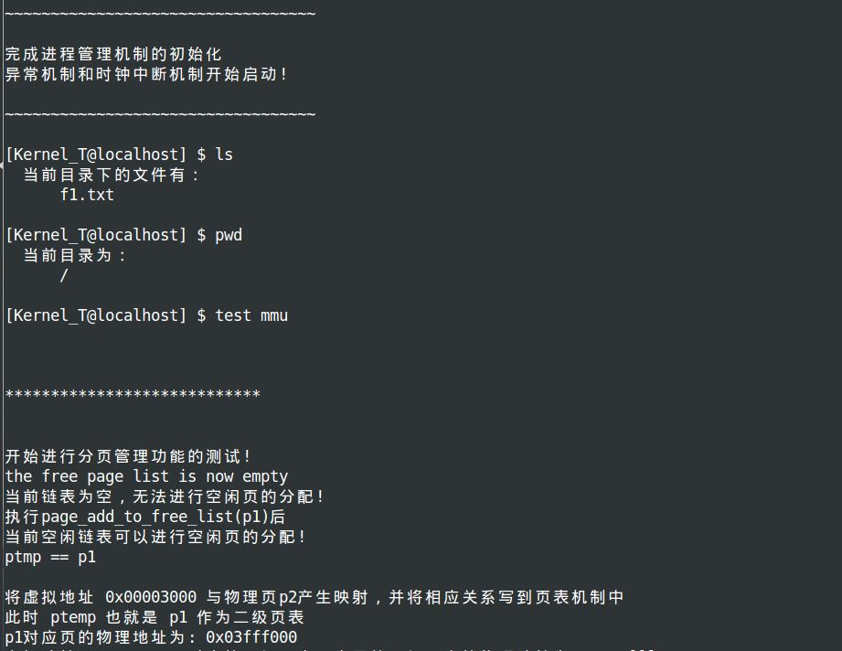
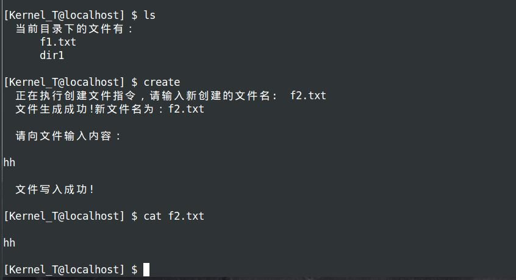

# :whale:Kernel_T
本项目（kernel_T）是一个基于龙芯处理器的操作系统内核，具备了内核启动，内存管理，进程管理，文件系统，shell等基本功能，当然它目前还只是一个toy kernel，和一个真正的操作系统还有很大的差距:sweat_drops:，不过对于想要快速了解和启动一个操作系统内核的初学者来说，尤其是GODSON架构下的操作系统内核，本项目是很有帮助的。内核的编写参考了linux、MIT的JOS和BUAA的mips kernel。
# :cactus:实验环境
* 主机平台：windows10
* 虚拟机软件：VirtualBox
* 操作系统：Ubuntu
* 模拟器：GXemul
* 交叉编译器：mips-gcc
  
  关于模拟器，GXemul可以直接加载操作系统内核，不用关心BIOS或者bootloader的编写，我们所要做的就是把内核通过ld文件链接加载到指定位置，然后进入到内核的入口执行即可，可以查看tools/myLds.lds文件，该文件中指定了.text的起始地址是0x8001 0000，这个地址是龙芯处理器开始读取命令的地址；同时制定了中断处理函数的位置在0x80000180，这也是龙芯处理器发生中断时默认的跳转位置，栈顶指针位置在物理内存4MB位置。文件中还制定了内核的入口函数'ENTRY(my_kernel_entry)',这个函数定义在==boot/start.S==文件中。
  
# :lemon:基本功能
## 打印功能
实现了printf函数，支持字符、字符串、数字的打印
## 内存管理
分页式物理内存管理，两级页表映射机制
## 进程管理
实现了模拟进程创建，调度，销毁过程，这里的进程还不是可以执行的elf程序:eyes:。调度过程基于优先级的时间片轮转调度算法，开启时钟中断。
## 文件管理
实现了创建，写入，读取，删除文件的操作，以及树形目录结构，通过磁盘控制器实现数据在内存和磁盘之间的传递，磁盘可以用dd命令创建一个大小为4kb的磁盘块作为虚拟磁盘。
## shell
通过shell，可以对实现的功能进行测试

# :part_alternation_mark:总结
本项目可以帮助你了解基于龙芯处理器的内核的编写方法，演示如下：

---

---

